---

# 🚀 AI Opportunity Scanner (Business Process → AI Scoring → Executive PDF)

An AI-powered automation workflow built using **n8n**, **OpenAI**, and **Google Sheets**.

This demo shows how business processes can be automatically evaluated for AI potential, commercially scored, prioritized, documented, and converted into an executive-ready PDF report — fully automated end-to-end.

---

# 🧠 Overview

The system simulates a production-ready **AI opportunity evaluation pipeline**:

1) Business process submitted via webhook  
2) Payload normalization  
3) AI opportunity analysis (structured JSON output)  
4) Weighted scoring logic  
5) Pipeline tracking (Google Sheets)  
6) Executive HTML report generation  
7) Automated PDF creation  
8) Execution proof in n8n  

---

# 🏗 System Architecture

High-level overview of the complete n8n pipeline (end-to-end):

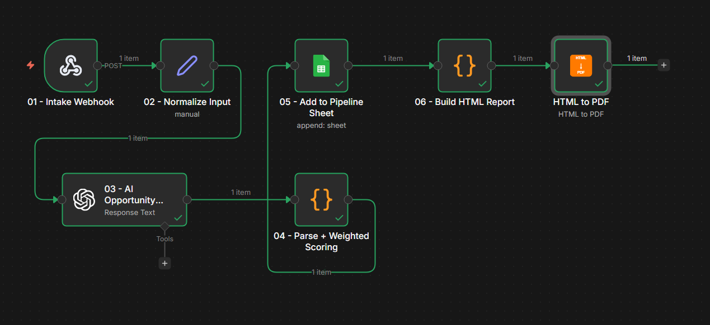

---

# 🔌 API / Webhook

Example API payload for incoming AI opportunity evaluation:

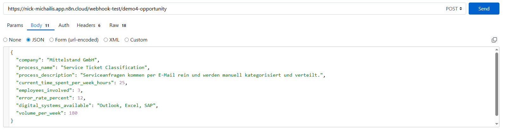

---

# ⚙️ Live Workflow (Step-by-Step)

## 01) Intake Webhook

Receives structured business process data via HTTP POST.

Typical fields:
- `company`
- `process_name`
- `process_description`
- `current_time_spent_per_week_hours`
- `employees_involved`
- `error_rate_percent`
- `digital_systems_available`
- `volume_per_week`

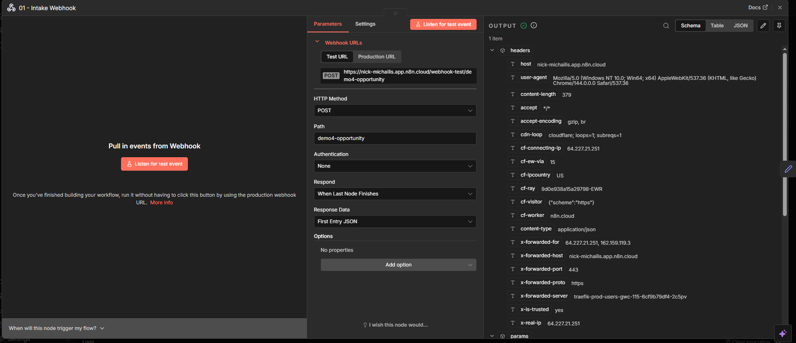

---

## 02) Normalize Input

Prepares and standardizes the payload before AI processing.

Ensures:
- consistent field naming  
- clean numeric values  
- safe downstream scoring  

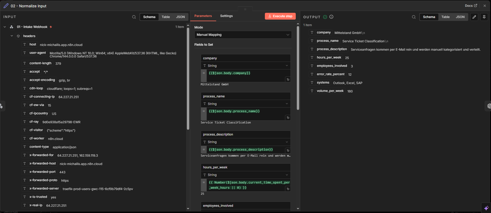

---

## 03) AI Opportunity Analysis

OpenAI evaluates the business case and returns **strict structured JSON** including:

- `automation_potential_score`
- `business_impact_score`
- `data_availability_score`
- `complexity_score`
- `recommended_ai_solution`
- `estimated_implementation_effort_weeks`
- `roi_estimate_12_months_eur`
- `priority_level`
- `executive_summary`

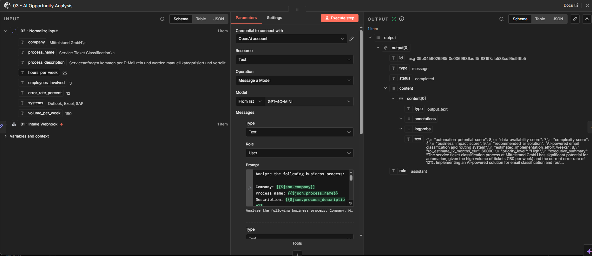

---

## 04) Parse + Weighted Scoring

Custom JavaScript logic calculates:

- Final weighted score  
- ROI bucket  
- Priority category  
- Score explanation object  

Example weight logic:
- Automation: 30%
- Business Impact: 30%
- Data Availability: 20%
- Ease (10 - Complexity): 20%

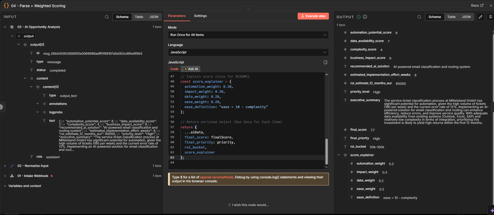

---

## 05) Add to AI Pipeline (Google Sheets)

Automatically logs each evaluated opportunity into a structured tracking sheet including:

- Company  
- Process  
- Scores  
- ROI  
- Priority  
- Executive summary  

Creates a lightweight **AI opportunity pipeline dashboard**.

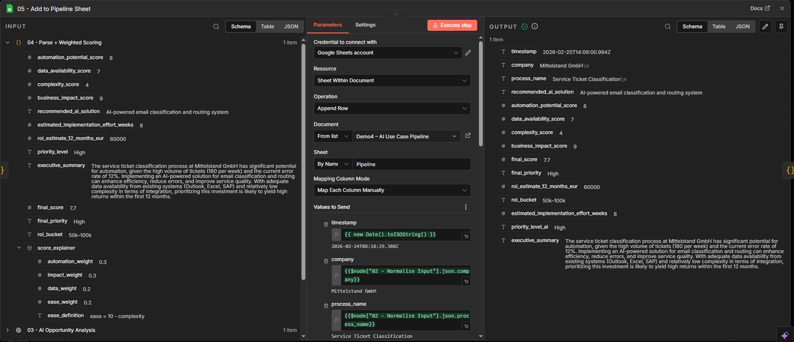

---

## 06) Build Executive HTML Report

Generates a clean, consultant-style executive report including:

- Final score  
- Priority  
- ROI estimate  
- Effort estimate  
- Recommended solution  
- Executive summary  
- Next steps roadmap  

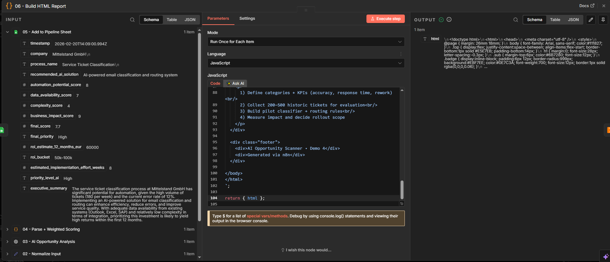

---

## 07) Convert HTML → PDF

Automatically converts the executive report into a professional PDF document.

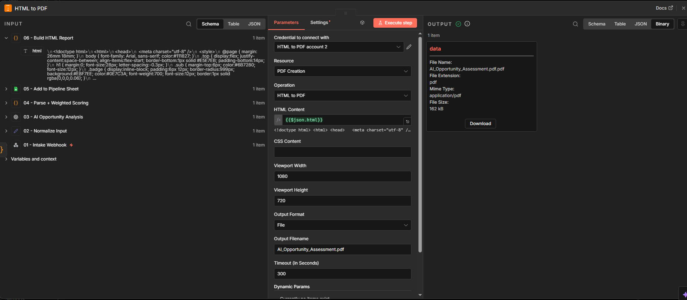

---

# 📄 Final Result – Executive PDF

Example of the generated AI Opportunity Assessment:

- Consultant-grade layout  
- Structured evaluation  
- Clear prioritization  
- Executive-ready presentation  

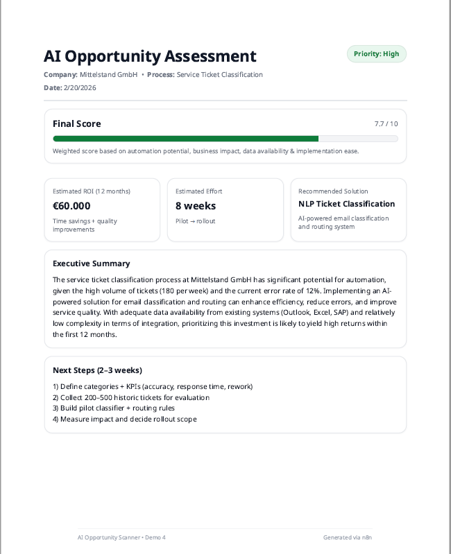
📄 Full PDF: [Download AI Opportunity Assessment](ai-opportunity-assessment.pdf)

---

## 📊 Pipeline Tracking Example

Logged AI use cases inside Google Sheets:

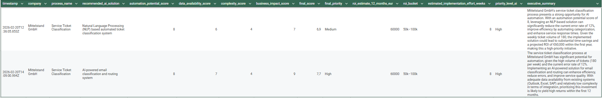

---

## ✅ Execution Proof

Successful full workflow execution inside n8n:

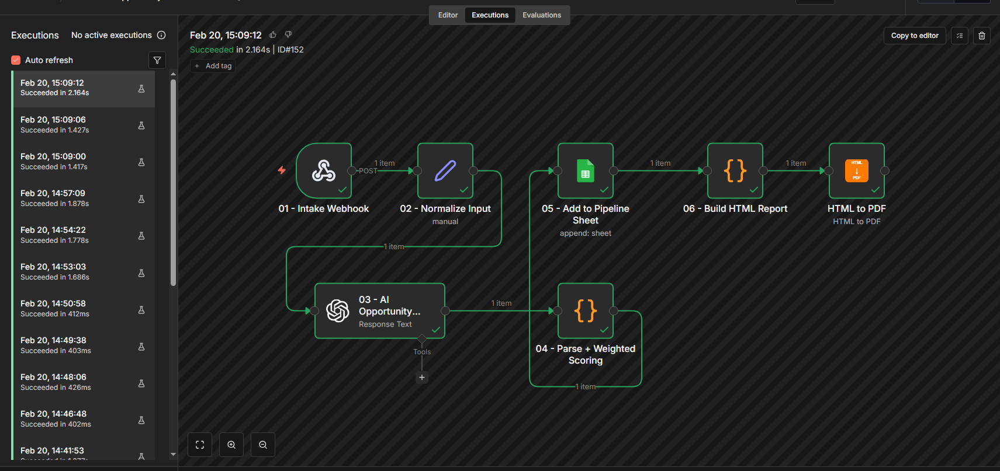

---

# 💼 Business Impact

- Standardized AI opportunity evaluation
- Data-driven prioritization of automation initiatives
- Executive-ready reporting in seconds
- Transparent ROI estimation
- Scalable AI pipeline tracking
- Reduced subjective decision-making

---

# 📈 Scalability Potential

This architecture can be extended to:

- CRM integration (HubSpot / Salesforce)
- Automatic AI project backlog creation
- Cost benchmarking models
- Multi-project portfolio dashboards
- Automated proposal generation
- Internal AI strategy tooling
- Board-ready reporting packages

---

# 🛠 Technology Stack

- n8n (workflow orchestration)
- OpenAI API (LLM-based opportunity evaluation)
- Webhook (real-time intake)
- Google Sheets (pipeline tracking)
- HTML → PDF automation

---

# 🔥 What This Demonstrates

- Structured LLM output enforcement  
- Business scoring logic implementation  
- AI opportunity prioritization methodology  
- Executive reporting automation  
- Portfolio-style AI pipeline design  
- End-to-end automation architecture  
